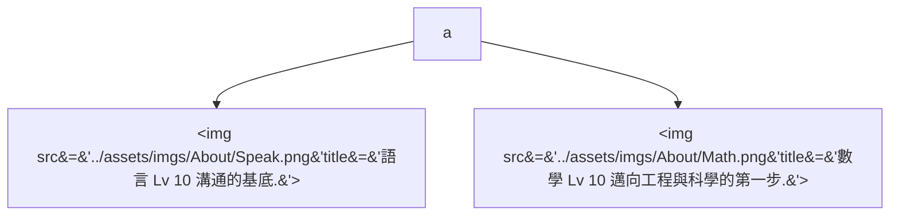

## 有關於作者
臺灣科技大學資訊工程系畢業，內心渴求著可以共同奮鬥的同伴的遊戲開發者，尋找工作中。  

```mermaid
graph TD; 
a
-->
b[&lt;img src&#61;&#39;../assets/imgs/About/Speak.png&#39;title&#61;&#39;語言 Lv 10 溝通的基底.&#39;&gt;]
a
-->
c[&lt;img src&#61;&#39;../assets/imgs/About/Math.png&#39;title&#61;&#39;數學 Lv 10 邁向工程與科學的第一步.&#39;&gt;]
```

